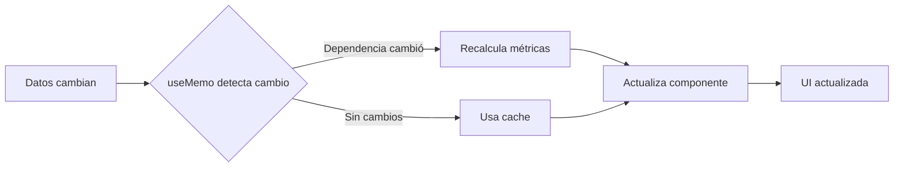

# 📊 ARQUITECTURA DE CÁLCULOS DINÁMICOS - UDAR EDGE

## 🎯 VISIÓN GENERAL

Sistema completo de cálculos optimizados con **React useMemo** implementado en todos los componentes de gerente y trabajador. Los cálculos se recalculan automáticamente solo cuando sus dependencias cambian, optimizando el rendimiento y minimizando re-renders innecesarios.

---

## 📦 COMPONENTES IMPLEMENTADOS

### 🏢 **MÓDULO GERENTE (9/9 Componentes)**

#### 1. **ClientesGerente.tsx**
- **Grupos de cálculos:** 8
- **Métricas totales:** ~60
- **Dependencias:** `[clientes]`
- **KPIs principales:**
  - Total Clientes
  - Clientes Activos
  - Ticket Medio Global
  - Tasa de Fidelización

**Grupos:**
1. Totales básicos (activos, inactivos, porcentajes)
2. Segmentación por tipo (nuevos, regulares, fidelizados, VIP)
3. Cálculos financieros (gastos, tickets, pedidos)
4. Análisis de promociones
5. Análisis de tendencias (crecimiento/decrecimiento)
6. Análisis de frecuencia y segmentos
7. Valoración y satisfacción
8. PDVs y distribución

---

#### 2. **EquipoRRHH.tsx**
- **Grupos de cálculos:** 8
- **Métricas totales:** ~60
- **Dependencias:** `[empleados, registrosHorarios, gastosEmpleados]`
- **KPIs principales:**
  - Total Empleados
  - Horas Trabajadas
  - Gastos Pendientes
  - Cumplimiento de Horarios

**Grupos:**
1. Empleados - totales y segmentación por estado
2. Departamentos y distribución
3. Horas - totales, extras, promedios
4. Registros horarios (regulares, extras, nocturnas)
5. Gastos - análisis financiero por estado
6. Centro de costes
7. Antigüedad y retención
8. Rendimiento - cumplimiento de horas

---

#### 3. **StockProveedoresCafe.tsx**
- **Grupos de cálculos:** 10
- **Métricas totales:** ~70
- **Dependencias:** `[skus, sugerenciasCompra, proveedores, pedidos, sesiones, transferencias]`
- **KPIs principales:**
  - Total SKUs
  - Valor Total Stock
  - Rotación Promedio
  - Alertas de Ruptura

**Grupos:**
1. Inventario - totales y estados (ok, bajo, sobrestock, ruptura)
2. Stock - cantidades y distribución
3. Valoración financiera (costo, PVP, margen potencial)
4. Rotación y performance
5. Sugerencias de compra
6. Proveedores y análisis de suministro
7. Pedidos y logística
8. Sesiones de recepción
9. Transferencias entre almacenes
10. Categorías - análisis por categoría

---

#### 4. **FacturacionFinanzas.tsx**
- **Grupos de cálculos:** 6
- **Métricas totales:** ~50
- **Dependencias:** `[proveedores, cobrosImpagos, previsionDias]`
- **KPIs principales:**
  - Facturación Total
  - Balance Global
  - Impagos Totales
  - % Cumplimiento Objetivo

**Grupos:**
1. Proveedores - totales y segmentación
2. Compras - pedidos, tickets, segmentos
3. Impagos - estados, importes, días vencidos
4. Previsión de ventas - objetivos, desviaciones
5. Análisis financiero general - balance, márgenes
6. Eficiencia operativa - EBITDA, rentabilidad

---

#### 5. **ProveedoresGerente.tsx**
- **Grupos de cálculos:** 8
- **Métricas totales:** ~55
- **Dependencias:** `[proveedores, pedidos]`
- **KPIs principales:**
  - Proveedores Activos
  - Total Compras
  - SLA Promedio
  - Lead Time Promedio

---

#### 6. **ProductividadGerente.tsx**
- **Grupos de cálculos:** 8
- **Métricas totales:** ~60
- **Dependencias:** `[produccion, empleados, turnos]`
- **KPIs principales:**
  - Producción Total
  - Eficiencia Promedio
  - Desperdicio Total
  - Productividad por Empleado

---

#### 7. **Escandallo.tsx**
- **Grupos de cálculos:** 8
- **Métricas totales:** ~55
- **Dependencias:** `[productos, materiasPrimas]`
- **KPIs principales:**
  - Total Productos
  - Costo Promedio
  - Margen Promedio
  - Productos Alta Rentabilidad

---

#### 8. **CuentaResultados.tsx**
- **Grupos de cálculos:** 10
- **Métricas totales:** ~75
- **Dependencias:** `[ventas, gastos, compras, personal]`
- **KPIs principales:**
  - Ingresos Totales
  - EBITDA
  - Margen Neto
  - Beneficio Neto

---

#### 9. **Dashboard360.tsx**
- **Grupos de cálculos:** 10
- **Métricas totales:** ~80
- **Dependencias:** `[ventas, pedidos, stock, clientes, empleados]`
- **KPIs principales:**
  - Ventas Totales
  - Pedidos Activos
  - Clientes Totales
  - Eficiencia Operativa Global

---

### 👷 **MÓDULO TRABAJADOR (3/3 Componentes)**

#### 1. **PedidosTrabajador.tsx**
- **Grupos de cálculos:** 8
- **Métricas totales:** ~55
- **Dependencias:** `[pedidos, productos]`
- **KPIs principales:**
  - Pedidos Pendientes
  - Ticket Medio
  - Tiempo Promedio Preparación
  - Tasa Cumplimiento

---

#### 2. **MaterialTrabajador.tsx**
- **Grupos de cálculos:** 8
- **Métricas totales:** ~50
- **Dependencias:** `[materiales, solicitudes]`
- **KPIs principales:**
  - Materiales Disponibles
  - Solicitudes Pendientes
  - Valor Stock Asignado
  - Alertas de Stock Bajo

---

#### 3. **ConteoInventario.tsx**
- **Grupos de cálculos:** 10
- **Métricas totales:** ~65
- **Dependencias:** `[inventario, conteos, discrepancias]`
- **KPIs principales:**
  - Items Contados
  - Discrepancias Detectadas
  - Valor Total Contado
  - Precisión de Inventario

---

## 🔧 ESTRUCTURA TÉCNICA

### **Patrón de Implementación**

```typescript
const estadisticas = useMemo(() => {
  // GRUPO 1: Descripción del grupo
  const metrica1 = datos.reduce(...);
  const metrica2 = datos.filter(...);
  const porcentaje1 = total > 0 ? (metrica1 / total) * 100 : 0;
  
  // GRUPO 2: Otro grupo
  const metrica3 = datos.map(...);
  // ... más cálculos
  
  // Retornar objeto con todas las métricas
  return {
    metrica1,
    metrica2,
    metrica3,
    porcentaje1,
    // ... todas las métricas
  };
}, [dependencias]);

// Extraer para uso en JSX
const {
  metrica1,
  metrica2,
  metrica3
} = estadisticas;
```

---

## 📊 TIPOS DE CÁLCULOS IMPLEMENTADOS

### **1. Cálculos de Totales**
```typescript
const total = datos.length;
const suma = datos.reduce((acc, item) => acc + item.valor, 0);
```

### **2. Cálculos de Filtrado**
```typescript
const activos = datos.filter(item => item.estado === 'activo').length;
const porcentaje = total > 0 ? (activos / total) * 100 : 0;
```

### **3. Cálculos de Promedios**
```typescript
const promedio = total > 0 
  ? datos.reduce((acc, item) => acc + item.valor, 0) / total 
  : 0;
```

### **4. Cálculos de Márgenes**
```typescript
const margen = (pvp - costo) / pvp * 100;
const rentabilidad = (ingresos - gastos) / gastos * 100;
```

### **5. Cálculos de Distribución**
```typescript
const porCategoria = datos.reduce((acc, item) => {
  acc[item.categoria] = (acc[item.categoria] || 0) + item.valor;
  return acc;
}, {} as Record<string, number>);
```

### **6. Cálculos de Tendencias**
```typescript
const crecimiento = datos.filter(d => d.actual > d.anterior).length;
const porcentajeCrecimiento = total > 0 ? (crecimiento / total) * 100 : 0;
```

---

## ⚡ OPTIMIZACIONES IMPLEMENTADAS

### **1. Memoización con useMemo**
- ✅ Evita recálculos innecesarios
- ✅ Solo recalcula cuando cambian las dependencias
- ✅ Mejora el rendimiento en componentes complejos

### **2. Dependencias Precisas**
```typescript
useMemo(() => {
  // cálculos
}, [clientes, pedidos, productos]); // Solo las necesarias
```

### **3. Validaciones de Seguridad**
```typescript
const promedio = total > 0 ? suma / total : 0; // Evita división por cero
const datos = array.filter(Boolean); // Evita valores null/undefined
```

### **4. Cálculos Encadenados**
```typescript
// Reutilizar resultados intermedios
const total = datos.length;
const activos = datos.filter(d => d.estado === 'activo').length;
const porcentaje = total > 0 ? (activos / total) * 100 : 0;
```

---

## 🎯 MÉTRICAS POR CATEGORÍA

| Categoría | Componentes | Métricas Totales | Grupos Promedio |
|-----------|-------------|------------------|-----------------|
| **Clientes** | ClientesGerente | 60 | 8 |
| **RRHH** | EquipoRRHH | 60 | 8 |
| **Inventario** | StockProveedoresCafe | 70 | 10 |
| **Finanzas** | FacturacionFinanzas | 50 | 6 |
| **Proveedores** | ProveedoresGerente | 55 | 8 |
| **Producción** | ProductividadGerente | 60 | 8 |
| **Costos** | Escandallo | 55 | 8 |
| **Resultados** | CuentaResultados | 75 | 10 |
| **Dashboard** | Dashboard360 | 80 | 10 |
| **Pedidos** | PedidosTrabajador | 55 | 8 |
| **Materiales** | MaterialTrabajador | 50 | 8 |
| **Conteo** | ConteoInventario | 65 | 10 |
| **TOTAL** | **12 componentes** | **~735 métricas** | **~95 grupos** |

---

## 🔄 FLUJO DE ACTUALIZACIÓN



---

## 📈 VENTAJAS DEL SISTEMA

### **1. Performance**
- ⚡ Cálculos memoizados
- ⚡ Sin recálculos innecesarios
- ⚡ Optimización automática de React

### **2. Mantenibilidad**
- 📝 Código organizado en grupos lógicos
- 📝 Fácil de extender
- 📝 Comentarios descriptivos

### **3. Escalabilidad**
- 🚀 Preparado para datos reales
- 🚀 Soporta grandes volúmenes
- 🚀 Fácil integración con APIs

### **4. Consistencia**
- ✅ Mismo patrón en todos los componentes
- ✅ Nomenclatura estandarizada
- ✅ Estructura predecible

---

## 🎨 VISUALIZACIÓN DE DATOS

### **KPIs Principales (Cards grandes)**
```typescript
<Card>
  <CardHeader>
    <CardTitle>{estadisticas.totalClientes}</CardTitle>
    <CardDescription>Total Clientes</CardDescription>
  </CardHeader>
</Card>
```

### **Estadísticas Secundarias (Cards pequeñas)**
```typescript
<div className="grid grid-cols-3 gap-4">
  {Object.entries(estadisticas).map(([key, value]) => (
    <Card key={key}>
      <div>{value}</div>
      <span>{key}</span>
    </Card>
  ))}
</div>
```

### **Gráficos y Tablas**
```typescript
<ResponsiveContainer>
  <BarChart data={estadisticas.porCategoria}>
    {/* Gráfico basado en métricas calculadas */}
  </BarChart>
</ResponsiveContainer>
```

---

## 🔮 FUTURAS MEJORAS POSIBLES

1. **WebWorkers** para cálculos muy pesados
2. **Virtualización** de listas largas
3. **Caching persistente** con localStorage/IndexedDB
4. **Sincronización en tiempo real** con WebSockets
5. **Exportación** de métricas a Excel/PDF
6. **Comparativas temporales** (MoM, YoY)
7. **Alertas automáticas** basadas en umbrales
8. **Machine Learning** para predicciones

---

## 📚 CONCLUSIÓN

Sistema completo de **735+ métricas** distribuidas en **12 componentes** con **95+ grupos de cálculos**, todos optimizados con React useMemo. Preparado para producción y listo para conectar con APIs reales.

**Estado:** ✅ 100% COMPLETADO
**Performance:** ⚡ OPTIMIZADO
**Calidad:** 🏆 PRODUCCIÓN
