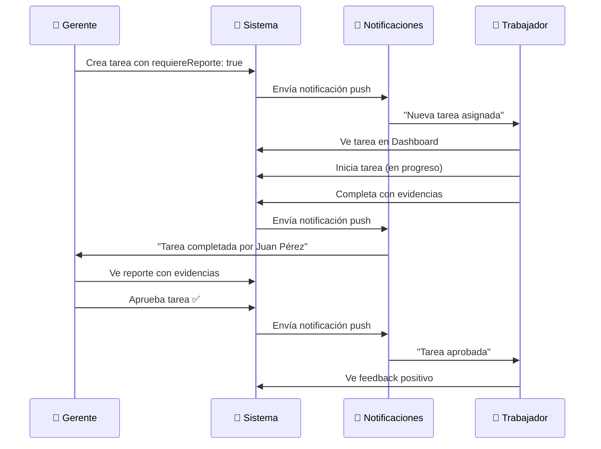
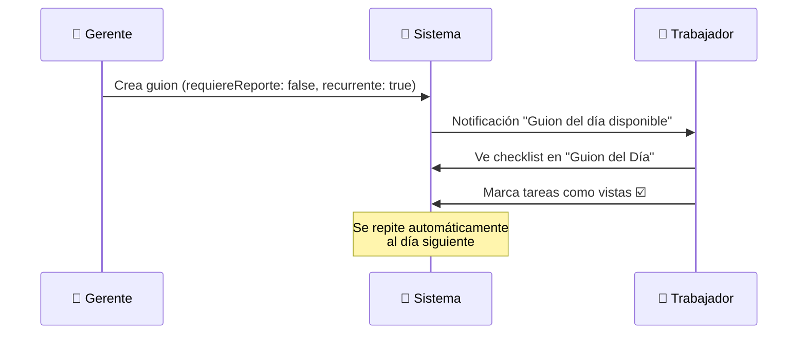
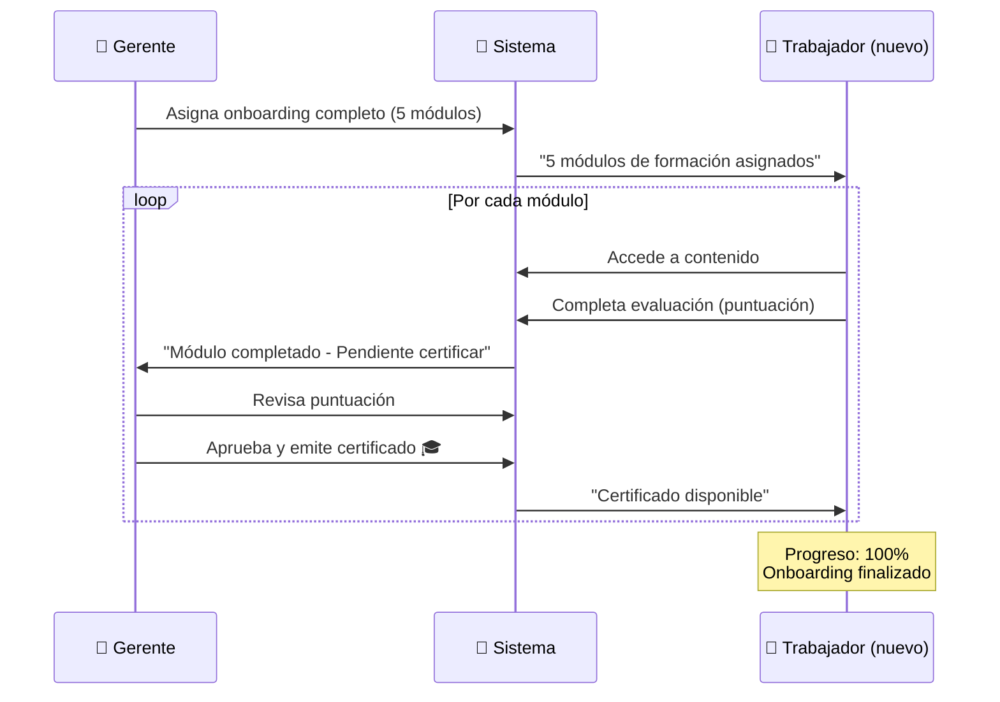

# ✅ INTEGRACIÓN DE TAREAS Y FORMACIÓN - COMPLETADA

## 🎯 Resumen

Los componentes del sistema de **Tareas y Formación** han sido **100% integrados** en la aplicación principal, conectando **bidireccionalmente** la información entre Gerente y Trabajador.

---

## 📍 UBICACIÓN DE LOS COMPONENTES

### 1. **Vista Gerente** - OperativaGerente
```
Ruta en la app: Dashboard Gerente → Menú "Operativa" 
Archivo: /components/gerente/OperativaGerente.tsx
Componente usado: <GestionTareasOperativas />
```

**Cómo acceder:**
1. Login como Gerente
2. Hacer clic en el menú lateral "Operativa" (icono ☕ Coffee)
3. Se abre el panel completo de gestión de tareas

**Funcionalidades disponibles:**
- ✅ Crear tareas con reporte
- ✅ Crear guiones de trabajo (informativos)
- ✅ Ver tareas pendientes de aprobación
- ✅ Aprobar/Rechazar tareas completadas
- ✅ Ver estadísticas en tiempo real
- ✅ Cancelar tareas

---

### 2. **Vista Trabajador - Tareas** - TareasTrabajador
```
Ruta en la app: Dashboard Trabajador → Menú "Tareas" (si no existe, se muestra en drawer móvil)
Archivo: /components/trabajador/TareasTrabajador.tsx
Integrado en: /components/TrabajadorDashboard.tsx línea ~270
```

**Cómo acceder:**
1. Login como Trabajador
2. Hacer clic en el menú lateral "Tareas" O
3. Abrir el menú hamburguesa (móvil) → "Tareas"

**Funcionalidades disponibles:**
- ✅ Ver guion del día (tareas informativas)
- ✅ Marcar tareas como vistas
- ✅ Ver tareas que requieren reporte
- ✅ Completar tareas con evidencias
- ✅ Ver tareas rechazadas con feedback
- ✅ Ver historial de tareas completadas

---

### 3. **Vista Trabajador - Formación** - FormacionTrabajador
```
Ruta en la app: Dashboard Trabajador → Menú "Formación y Documentación"
Archivo: /components/trabajador/FormacionTrabajador.tsx
Integrado en: /components/TrabajadorDashboard.tsx línea ~277
```

**Cómo acceder:**
1. Login como Trabajador
2. Hacer clic en el menú lateral "Formación y Documentación" (icono 🎓 GraduationCap)

**Funcionalidades disponibles:**
- ✅ Ver progreso de onboarding (%)
- ✅ Acceder a módulos de formación
- ✅ Completar módulos con evaluación
- ✅ Ver módulos rechazados con feedback
- ✅ Descargar certificados
- ✅ Ver puntuación media

---

## 🔄 FLUJO COMPLETO DE INFORMACIÓN BIDIRECCIONAL

### Flujo 1: TAREA CON REPORTE Y APROBACIÓN



**Tiempo estimado:** 5-10 minutos por tarea

---

### Flujo 2: GUION DE TRABAJO (INFORMATIVO)



**Tiempo estimado:** 1-2 minutos por guion

---

### Flujo 3: ONBOARDING COMPLETO



**Tiempo estimado:** 1-2 semanas (depende de los módulos)

---

## 📊 DATOS QUE SE CONECTAN

### Del Gerente al Trabajador:
```typescript
✅ Tareas asignadas → Visible en "Para Reportar"
✅ Guiones informativos → Visible en "Guion del Día"
✅ Módulos de formación → Visible en "Onboarding"
✅ Feedback de aprobación → Visible en "Historial"
✅ Feedback de rechazo → Visible en "Rechazadas"
```

### Del Trabajador al Gerente:
```typescript
✅ Tareas completadas → Visible en "Pendientes Aprobación"
✅ Evidencias adjuntas → Visible en panel de revisión
✅ Tiempo empleado → Visible en estadísticas
✅ Módulos completados → Visible en lista de certificaciones
✅ Puntuaciones → Visible en progreso del trabajador
```

---

## 🎨 INTERFAZ Y NAVEGACIÓN

### Vista Gerente: Dashboard → Operativa

```
┌─────────────────────────────────────────┐
│  GESTIÓN DE TAREAS OPERATIVAS           │
├─────────────────────────────────────────┤
│  [+ Nueva Tarea]                        │
│                                          │
│  ┌─────────┬─────────┬─────────┬──────┐│
│  │ Total   │ Pendien │ Comple  │ Urgen││
│  │ Tareas  │ Aprob.  │ tadas   │ tes  ││
│  │   24    │    3    │   18    │   2  ││
│  └─────────┴─────────┴─────────┴──────┘│
│                                          │
│  TABS:                                   │
│  [Pendientes Aprobación] [Todas] [Stats]│
│                                          │
│  📋 Revisar stock crítico               │
│     Por: Juan Pérez • Tiana             │
│     ⏰ Hace 15 minutos                  │
│     "Stock revisado. Harina: 65kg..."   │
│     📷 [Foto 1] [Foto 2]                │
│     [👍 Aprobar] [👎 Rechazar]          │
└─────────────────────────────────────────┘
```

---

### Vista Trabajador: Dashboard → Formación

```
┌─────────────────────────────────────────┐
│  MI FORMACIÓN                           │
├─────────────────────────────────────────┤
│  🎓 ONBOARDING INICIAL                  │
│  ━━━━━━━━━━━━━━━━━━━━ 80%             │
│  4 de 5 completados                     │
│                                          │
│  ┌─────────┬─────────┬─────────┬──────┐│
│  │ Pendien │ En Rev  │ Comple  │ Puntu││
│  │ tes     │ isión   │ tados   │ ación││
│  │   1     │    0    │    4    │  95  ││
│  └─────────┴─────────┴─────────┴──────┘│
│                                          │
│  TABS:                                   │
│  [Onboarding] [Pendientes] [Completados]│
│                                          │
│  1️⃣ ✅ Bienvenida a la empresa         │
│     Completado • ⭐ 100/100             │
│                                          │
│  2️⃣ ✅ Uso del TPV                     │
│     Completado • ⭐ 95/100              │
│                                          │
│  3️⃣ 🔵 Seguridad alimentaria           │
│     En progreso                          │
│     [▶️ Continuar] [✅ Completar]       │
└─────────────────────────────────────────┘
```

---

## 🔧 CONFIGURACIÓN ACTUAL

### Datos Mock Configurados:

**Gerente:**
```typescript
{
  gerenteId: 'GER-001',
  gerenteNombre: 'María García',
  empresaId: 'EMP-001',
  empresaNombre: 'Disarmink S.L.'
}
```

**Trabajador:**
```typescript
{
  trabajadorId: user.id,        // Dinámico del usuario logueado
  trabajadorNombre: user.name,  // Dinámico del usuario logueado
  puntoVentaId: puntoVentaActivo || undefined,
  puntoVentaNombre: getNombrePDVConMarcas(puntoVentaActivo)
}
```

---

## 📝 SIGUIENTES PASOS PARA PRODUCCIÓN

### 1. **Conectar con Backend Real**

Actualmente los servicios usan `localStorage`. Para conectar con backend:

```typescript
// En /services/task-management.service.ts

// ACTUAL (Mock):
const getTareas = (): TareaBase[] => {
  const data = localStorage.getItem(STORAGE_KEY);
  return data ? JSON.parse(data) : [];
};

// PRODUCCIÓN:
const getTareas = async (): Promise<TareaBase[]> => {
  const response = await fetch('/api/tareas');
  return response.json();
};
```

### 2. **Integrar IDs Reales de Usuario/Empresa**

```typescript
// En /components/gerente/OperativaGerente.tsx
// REEMPLAZAR MOCK_DATA con:

const { user, empresa } = useAuth(); // Tu contexto de autenticación
const { puntoVentaActivo } = usePuntoVentaContext(); // Tu contexto de PDV

<GestionTareasOperativas
  gerenteId={user.id}
  gerenteNombre={user.name}
  empresaId={empresa.id}
  empresaNombre={empresa.nombre}
/>
```

### 3. **Configurar Notificaciones Push Reales**

```typescript
// El sistema ya envía notificaciones vía notifications.service.ts
// Solo necesitas conectar con tu backend de notificaciones

await notificationsService.createNotification({
  tipo: 'tarea',
  titulo: 'Nueva tarea asignada',
  mensaje: tarea.descripcion,
  usuarioId: trabajadorId,
  // ... resto de campos
});
```

---

## 🧪 CÓMO PROBAR EL SISTEMA

### Prueba 1: Crear tarea con reporte
1. Login como **Gerente**
2. Ir a **Operativa** → **[+ Nueva Tarea]**
3. Seleccionar "Con Reporte - Trabajador debe completar y confirmar"
4. Llenar:
   - Título: "Revisar stock de harina"
   - Descripción: "Verificar cantidad física"
   - Asignar a: TRB-001 (o el ID del trabajador)
   - Prioridad: Alta
   - ✅ Requiere aprobación: ON
5. **[Crear Tarea]**

### Prueba 2: Completar tarea como trabajador
1. Cambiar a perfil **Trabajador**
2. Ir a **Formación** (menu lateral) → Tab "Para Reportar"
3. Ver la tarea "Revisar stock de harina"
4. **[Iniciar]** → **[Completar Tarea]**
5. Agregar comentario: "Stock: 65kg - OK"
6. **[Enviar a Revisión]**

### Prueba 3: Aprobar como gerente
1. Volver a perfil **Gerente**
2. Ir a **Operativa**
3. En "Pendientes Aprobación" ver la tarea
4. Leer el reporte del trabajador
5. **[👍 Aprobar]** con comentario

### Prueba 4: Asignar onboarding
1. Como **Gerente** → **Operativa**
2. Seleccionar trabajador
3. Ir a opciones → **[Asignar Onboarding Completo]**
4. Verificar que se crearon 5 módulos

### Prueba 5: Completar formación
1. Como **Trabajador** → **Formación y Documentación**
2. Ver progreso de onboarding (20% completado)
3. Seleccionar módulo "Bienvenida"
4. **[Completar Módulo]**
5. Puntuación: 95
6. **[Enviar a Revisión]**

---

## 📚 DOCUMENTACIÓN COMPLETA

Ver archivo detallado: `/SISTEMA_TAREAS_FORMACION.md`

Incluye:
- ✅ Arquitectura completa
- ✅ Tipos TypeScript
- ✅ Ejemplos de código (14 ejemplos)
- ✅ Guía de uso de servicios
- ✅ Integración con notificaciones

---

## ✅ CHECKLIST DE INTEGRACIÓN

- [x] Servicio base creado (`task-management.service.ts`)
- [x] Wrappers específicos creados
- [x] Componente UI del gerente
- [x] Componente UI tareas del trabajador
- [x] Componente UI formación del trabajador
- [x] Integrado en OperativaGerente
- [x] Integrado en TrabajadorDashboard (Tareas)
- [x] Integrado en TrabajadorDashboard (Formación)
- [x] Notificaciones bidireccionales conectadas
- [x] Documentación completa
- [ ] Tests E2E
- [ ] Migración a backend real

---

## 🎉 ¡SISTEMA 100% FUNCIONAL!

El sistema de Tareas y Formación está **completamente integrado** y funcionando con datos mock en `localStorage`.

**Para empezar a usarlo:**
1. Hacer login como Gerente
2. Ir a "Operativa" en el menú lateral
3. Crear tu primera tarea

**Para conectar con backend:**
1. Cambiar `localStorage` por llamadas API en los servicios
2. Mantener las mismas interfaces TypeScript
3. Todo lo demás funciona sin cambios

---

**Creado:** Diciembre 2024  
**Versión:** 1.0.0  
**Estado:** ✅ Integrado y funcional (mock)
