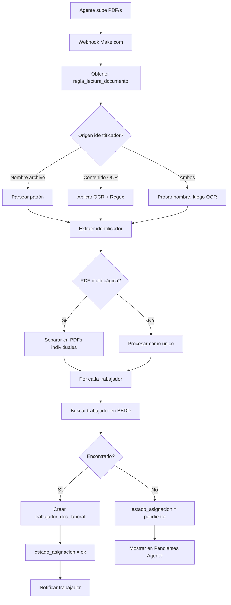
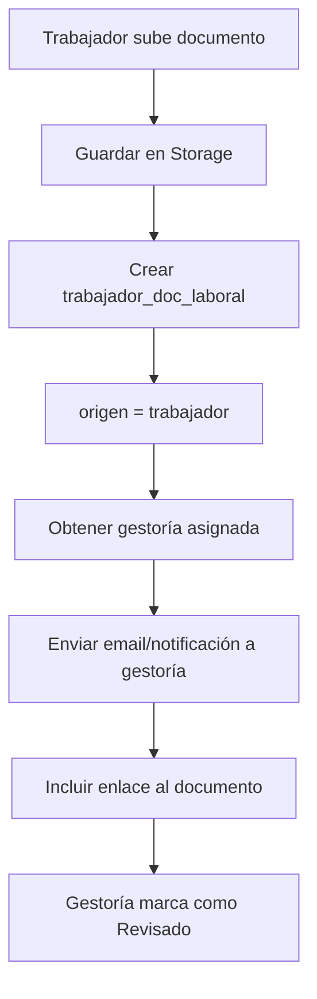
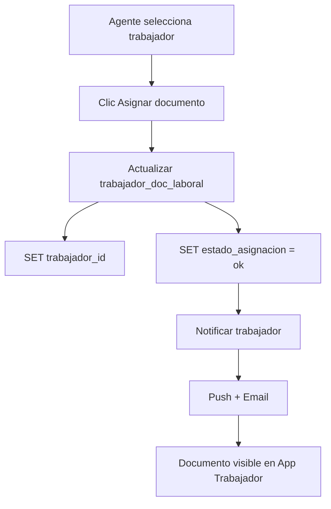

# 📄 SISTEMA DE DOCUMENTACIÓN LABORAL - UDAR EDGE

**Versión:** 1.0  
**Fecha:** 26 de Noviembre de 2025  
**Estado:** ✅ Completo y documentado

---

## 📋 RESUMEN EJECUTIVO

Sistema completo de gestión de documentación laboral que permite a **agentes externos** (gestorías laborales, proveedores) subir documentos PDF que se asignan **automáticamente** a trabajadores según **reglas configurables**. El sistema incluye OCR, detección inteligente de identificadores, y flujos automatizados de notificación.

---

## 🏗️ ARQUITECTURA DEL SISTEMA

```
┌─────────────────────────────────────────────────────────────────┐
│                    FLUJO DE DOCUMENTOS                           │
├─────────────────────────────────────────────────────────────────┤
│                                                                  │
│  📤 AGENTE EXTERNO                                               │
│  └─> Sube PDFs (uno o múltiples)                                │
│       ├─> Make.com: Procesa con OCR                             │
│       ├─> Aplica REGLAS DE LECTURA                              │
│       ├─> Detecta IDENTIFICADOR (DNI/código/nombre)             │
│       └─> Busca TRABAJADOR en BBDD                              │
│            ├─> ✅ ENCONTRADO → Asigna + Notifica                │
│            └─> ❌ NO ENCONTRADO → Cola "Pendientes"             │
│                                                                  │
│  👤 TRABAJADOR                                                   │
│  └─> Recibe notificación push/email                             │
│       └─> Accede a App > Documentación                          │
│            └─> Descarga nóminas/IRPF/contratos                  │
│                                                                  │
│  📎 TRABAJADOR (Subida "Otros")                                 │
│  └─> Sube baja médica, cambio cuenta, etc.                      │
│       └─> Se notifica AUTOMÁTICAMENTE a gestoría                │
│            └─> Gestoría marca como "Revisado"                   │
│                                                                  │
│  👨‍💼 GERENTE                                                       │
│  └─> Configuración Sistema > Agentes Externos                   │
│       └─> Define REGLAS por tipo de documento                   │
│            └─> Patrón archivo, campo identificador, OCR         │
└─────────────────────────────────────────────────────────────────┘
```

---

## 📊 ENTIDADES DE BASE DE DATOS

### 1. `trabajador_doc_laboral`

Almacena todos los documentos laborales de trabajadores.

```sql
CREATE TABLE trabajador_doc_laboral (
  doc_id UUID PRIMARY KEY DEFAULT gen_random_uuid(),
  trabajador_id UUID NOT NULL REFERENCES usuario(usuario_id),
  empresa_id UUID NOT NULL REFERENCES empresa(empresa_id),
  
  -- Clasificación
  tipo_doc VARCHAR(50) NOT NULL CHECK (tipo_doc IN ('nomina', 'contrato', 'irpf', 'otros')),
  subtipo_doc VARCHAR(100), -- Solo para "otros": "Baja médica", "Cambio cuenta", etc.
  
  -- Periodo (para nóminas e IRPF)
  periodo_mes INT CHECK (periodo_mes BETWEEN 1 AND 12),
  periodo_anio INT,
  
  -- Archivo
  fecha_documento TIMESTAMP NOT NULL DEFAULT CURRENT_TIMESTAMP,
  url_fichero TEXT NOT NULL,
  nombre_archivo VARCHAR(255),
  tamano_kb INT,
  
  -- Origen y procesamiento
  origen VARCHAR(50) NOT NULL CHECK (origen IN ('trabajador', 'agente_externo')),
  agente_externo_id UUID REFERENCES agente_externo(id),
  identificador_detectado VARCHAR(100), -- DNI/código/nombre detectado por OCR
  procesado_por_ocr BOOLEAN DEFAULT false,
  metodo_deteccion VARCHAR(50), -- 'nombre_archivo', 'ocr', 'manual'
  
  -- Estado
  estado_asignacion VARCHAR(50) NOT NULL DEFAULT 'ok' CHECK (estado_asignacion IN ('ok', 'pendiente', 'error')),
  
  -- Auditoría
  created_at TIMESTAMP DEFAULT CURRENT_TIMESTAMP,
  updated_at TIMESTAMP DEFAULT CURRENT_TIMESTAMP,
  
  -- Índices
  INDEX idx_trabajador_tipo (trabajador_id, tipo_doc),
  INDEX idx_periodo (periodo_anio, periodo_mes),
  INDEX idx_estado (estado_asignacion),
  INDEX idx_agente (agente_externo_id)
);
```

**Ejemplo de registros:**

```json
// Nómina subida por gestoría
{
  "doc_id": "DOC-NOM-001",
  "trabajador_id": "TRAB-123",
  "empresa_id": "EMP-001",
  "tipo_doc": "nomina",
  "periodo_mes": 11,
  "periodo_anio": 2025,
  "fecha_documento": "2025-11-05T10:00:00Z",
  "url_fichero": "/storage/nominas/2025-11_12345678A.pdf",
  "nombre_archivo": "NOMINA_2025-11_12345678A.pdf",
  "tamano_kb": 248,
  "origen": "agente_externo",
  "agente_externo_id": "AGENTE-001",
  "identificador_detectado": "12345678A",
  "procesado_por_ocr": true,
  "metodo_deteccion": "nombre_archivo",
  "estado_asignacion": "ok"
}

// Baja médica subida por trabajador
{
  "doc_id": "DOC-OTR-001",
  "trabajador_id": "TRAB-123",
  "empresa_id": "EMP-001",
  "tipo_doc": "otros",
  "subtipo_doc": "Baja médica",
  "fecha_documento": "2025-11-20T14:30:00Z",
  "url_fichero": "/storage/otros/baja_medica_20nov2025.pdf",
  "nombre_archivo": "baja_medica_20nov2025.pdf",
  "tamano_kb": 156,
  "origen": "trabajador",
  "procesado_por_ocr": false,
  "estado_asignacion": "ok"
}
```

---

### 2. `agente_externo`

Registro de gestorías, proveedores y otros agentes externos.

```sql
CREATE TABLE agente_externo (
  id UUID PRIMARY KEY DEFAULT gen_random_uuid(),
  nombre VARCHAR(255) NOT NULL,
  tipo_agente VARCHAR(50) NOT NULL CHECK (tipo_agente IN ('gestoria_laboral', 'proveedor_facturas', 'otro')),
  
  -- Multiempresa
  empresas_asignadas UUID[] NOT NULL, -- Array de empresa_id
  
  -- Estado
  estado VARCHAR(50) NOT NULL DEFAULT 'activo' CHECK (estado IN ('activo', 'bloqueado')),
  
  -- Contacto
  email_contacto VARCHAR(255),
  telefono VARCHAR(50),
  
  -- Credenciales de acceso (si tiene login web)
  usuario_login VARCHAR(100) UNIQUE,
  password_hash TEXT,
  
  -- Auditoría
  created_at TIMESTAMP DEFAULT CURRENT_TIMESTAMP,
  updated_at TIMESTAMP DEFAULT CURRENT_TIMESTAMP,
  created_by UUID REFERENCES usuario(usuario_id),
  
  INDEX idx_tipo (tipo_agente),
  INDEX idx_estado (estado),
  INDEX idx_empresas USING GIN (empresas_asignadas)
);
```

**Ejemplo de registro:**

```json
{
  "id": "AGENTE-001",
  "nombre": "Gestoría Laboral López",
  "tipo_agente": "gestoria_laboral",
  "empresas_asignadas": ["EMP-001", "EMP-002"],
  "estado": "activo",
  "email_contacto": "gestoria@lopez.com",
  "telefono": "+34 912 345 678",
  "usuario_login": "gestoria_lopez",
  "password_hash": "$2b$10$..."
}
```

---

### 3. `regla_lectura_documento`

Reglas configurables para cada agente externo y tipo de documento.

```sql
CREATE TABLE regla_lectura_documento (
  regla_id UUID PRIMARY KEY DEFAULT gen_random_uuid(),
  agente_externo_id UUID NOT NULL REFERENCES agente_externo(id) ON DELETE CASCADE,
  
  -- Tipo de documento al que aplica
  tipo_doc VARCHAR(50) NOT NULL CHECK (tipo_doc IN ('nomina', 'contrato', 'irpf', 'factura', 'otros')),
  
  -- Configuración de detección
  campo_identificador_preferido VARCHAR(100) NOT NULL 
    CHECK (campo_identificador_preferido IN ('dni', 'nif', 'codigo_interno_trabajador', 'email', 'nombre_completo')),
  origen_identificador VARCHAR(50) NOT NULL 
    CHECK (origen_identificador IN ('nombre_archivo', 'contenido_ocr', 'ambos')),
  
  -- Patrón de nombre de archivo (opcional)
  patron_nombre_archivo TEXT,
  -- Ejemplos:
  --   NOMINA_{anio}-{mes}_{dni}.pdf
  --   CONTRATO_{nombre_completo}_{fecha}.pdf
  --   IRPF_{anio}_{dni}.pdf
  
  -- Configuración OCR (opcional, para equipo técnico)
  patron_regex_ocr TEXT, -- Expresión regular para extraer identificador del OCR
  pagina_ocr_inicio INT DEFAULT 1, -- En qué página buscar (1 = primera)
  
  -- Observaciones para el equipo técnico
  observaciones TEXT,
  
  -- Auditoría
  created_at TIMESTAMP DEFAULT CURRENT_TIMESTAMP,
  updated_at TIMESTAMP DEFAULT CURRENT_TIMESTAMP,
  
  -- Índices
  UNIQUE (agente_externo_id, tipo_doc),
  INDEX idx_tipo_doc (tipo_doc)
);
```

**Ejemplos de reglas:**

```json
// REGLA 1: Nóminas de Gestoría López
{
  "regla_id": "REGLA-001",
  "agente_externo_id": "AGENTE-001",
  "tipo_doc": "nomina",
  "campo_identificador_preferido": "dni",
  "origen_identificador": "nombre_archivo",
  "patron_nombre_archivo": "NOMINA_{anio}-{mes}_{dni}.pdf",
  "observaciones": "Formato estándar: NOMINA_2025-11_12345678A.pdf"
}

// REGLA 2: Contratos de Gestoría López
{
  "regla_id": "REGLA-002",
  "agente_externo_id": "AGENTE-001",
  "tipo_doc": "contrato",
  "campo_identificador_preferido": "nombre_completo",
  "origen_identificador": "contenido_ocr",
  "patron_regex_ocr": "Trabajador:\\s*([A-ZÁÉÍÓÚÑ\\s]+)",
  "pagina_ocr_inicio": 1,
  "observaciones": "Detectar 'Trabajador: NOMBRE APELLIDOS' en primera página"
}

// REGLA 3: IRPF (combinado)
{
  "regla_id": "REGLA-003",
  "agente_externo_id": "AGENTE-001",
  "tipo_doc": "irpf",
  "campo_identificador_preferido": "dni",
  "origen_identificador": "ambos",
  "patron_nombre_archivo": "IRPF_{anio}_{dni}.pdf",
  "patron_regex_ocr": "DNI:\\s*([0-9]{8}[A-Z])",
  "observaciones": "Priorizar nombre archivo, validar con OCR si falla"
}
```

---

## 🎨 INTERFACES DE USUARIO

### 1. UI TRABAJADOR - `DocumentacionLaboral.tsx`

**Ubicación:** Colaborador > Documentación

**Características:**

✅ **Tabs superiores:**
- 📄 Nóminas (con contador de documentos)
- 📋 IRPF (con contador de documentos)
- 📎 Otros (con contador de documentos)

✅ **Bloque fijo superior:**
- "Contrato Laboral Vigente" (destacado en verde)
- Muestra último contrato activo
- Botón de descarga

✅ **Tablas por tipo de documento:**

| Columna | Descripción |
|---------|-------------|
| Documento | Nombre archivo + origen (gestoría/trabajador) |
| Periodo | Mes/Año para nóminas, Año para IRPF |
| Fecha publicación | Cuándo se subió el documento |
| Tamaño | KB o MB |
| Acciones | Ver 👁️ / Descargar ⬇️ |

✅ **Pestaña "Otros" - Subir documento:**
- Botón `+ Subir documento`
- Modal con campos:
  - Tipo de documento (dropdown): Baja médica, Cambio cuenta bancaria, Justificante, etc.
  - Comentario opcional (textarea)
  - Adjuntar archivo (dropzone PDF, máx 5MB)
- Al guardar:
  - ✅ Registro en `trabajador_doc_laboral` con `origen = 'trabajador'`
  - 📧 Notificación automática a gestoría vía Make.com

---

### 2. UI AGENTE EXTERNO - `PanelAgenteExterno.tsx`

**Acceso:** Login con credenciales de agente externo (ROL: `AGENTE_EXTERNO`)

**2.1. Pantalla "Subir documentos"**

✅ **Selectores obligatorios:**
- Empresa (dropdown con empresas asignadas)
- Tipo de documento (Nóminas / Contratos / IRPF)

✅ **Área de subida:**
- Dropzone que acepta:
  - 1 PDF único con todas las nóminas
  - Múltiples PDFs individuales
- Texto informativo:
  > "Puedes subir un PDF único con todas las nóminas o varios PDF individuales. El sistema intentará asignar cada documento al trabajador según las reglas configuradas para tu gestoría."

✅ **Botón "Procesar documentos":**
- Envía PDFs a Make.com
- Aplica OCR
- Ejecuta reglas de detección
- Muestra tabla de resultados

✅ **Tabla de procesamiento:**

| Columna | Descripción |
|---------|-------------|
| Archivo | Nombre del PDF |
| Tipo de documento | Nómina / Contrato / IRPF |
| Identificador detectado | DNI/código/nombre extraído |
| Trabajador asignado | Nombre completo si se encontró |
| Estado | 🔄 Procesando / ✅ Asignado / ⏳ Pendiente / ❌ Error |
| Acción | Ver / Asignar manual |

**Badges de estado:**
- 🔵 **Procesando:** OCR en curso
- 🟢 **Asignado:** Trabajador encontrado y documento publicado
- 🟠 **Pendiente:** No se encontró trabajador (ir a pestaña "Pendientes")
- 🔴 **Error:** Fallo en procesamiento

**2.2. Pantalla "Pendientes de asignar"**

✅ **Tabla con documentos sin asignar:**

| Columna | Descripción |
|---------|-------------|
| 📄 Miniatura/icono | Icono PDF con preview |
| Identificador detectado | Texto extraído del OCR |
| Empresa | Empresa relacionada |
| Seleccionar trabajador | Dropdown con búsqueda |
| Acción | Botón "Asignar documento" |

✅ **Flujo de asignación manual:**
1. Agente busca trabajador por nombre/DNI
2. Selecciona trabajador del dropdown
3. Clic en "Asignar documento"
4. Sistema:
   - Actualiza `estado_asignacion = 'ok'`
   - Publica documento en app del trabajador
   - Envía notificación push/email al trabajador

---

### 3. UI GERENTE - `ConfiguracionAgentesExternos.tsx`

**Ubicación:** Configuración Sistema > Agentes Externos

**Características:**

✅ **Lista de agentes externos:**
- Tarjetas con información resumida
- Estado: 🟢 Activo / 🔴 Bloqueado
- Botones: Editar / Bloquear / Eliminar

✅ **Información por agente:**
- Nombre
- Tipo (Gestoría Laboral / Proveedor Facturas / Otro)
- Empresas vinculadas
- Email y teléfono de contacto
- Estado (activo/bloqueado)

✅ **Sección "Reglas de lectura de documentos":**

Acordeón expandible por tipo de documento:

📄 **NÓMINAS**
- Campo identificador preferido: `DNI`
- Origen del identificador: `Nombre de archivo`
- Patrón: `NOMINA_{anio}-{mes}_{dni}.pdf`
- Observaciones: "Formato estándar mensual"

📋 **CONTRATOS**
- Campo identificador preferido: `Nombre completo`
- Origen del identificador: `Contenido OCR`
- Patrón regex: `Trabajador:\s*([A-Z\s]+)`
- Observaciones: "Buscar en primera página del contrato"

📊 **IRPF**
- Campo identificador preferido: `DNI`
- Origen del identificador: `Ambos`
- Patrón archivo: `IRPF_{anio}_{dni}.pdf`
- Patrón OCR: `DNI:\s*([0-9]{8}[A-Z])`
- Observaciones: "Priorizar nombre de archivo, validar con OCR"

✅ **Modal "Crear/Editar Agente":**
- Nombre del agente *
- Tipo de agente * (dropdown)
- Empresas asignadas * (checkboxes múltiples)
- Email de contacto
- Teléfono
- Info: "Después de crear el agente, podrás configurar las reglas de lectura"

---

## 🔄 FLUJOS DE DATOS (Make.com / Backend)

### FLUJO 1: Subida de PDFs por Agente Externo



**Pseudocódigo:**

```javascript
// WEBHOOK: /api/agente-externo/subir-documentos

async function procesarDocumentosAgenteExterno(payload) {
  const {
    agente_externo_id,
    empresa_id,
    tipo_doc,
    archivos // Array de PDFs
  } = payload;
  
  // 1. Obtener regla de lectura
  const regla = await db.query(`
    SELECT * FROM regla_lectura_documento
    WHERE agente_externo_id = $1 AND tipo_doc = $2
  `, [agente_externo_id, tipo_doc]);
  
  if (!regla) {
    return { error: 'No hay regla configurada para este tipo de documento' };
  }
  
  const resultados = [];
  
  for (const archivo of archivos) {
    let identificador = null;
    let metodo_deteccion = null;
    
    // 2. Detectar identificador según regla
    if (regla.origen_identificador === 'nombre_archivo' || regla.origen_identificador === 'ambos') {
      identificador = parsearNombreArchivo(archivo.nombre, regla.patron_nombre_archivo);
      metodo_deteccion = 'nombre_archivo';
    }
    
    if (!identificador && (regla.origen_identificador === 'contenido_ocr' || regla.origen_identificador === 'ambos')) {
      const textoOCR = await aplicarOCR(archivo, regla.pagina_ocr_inicio);
      identificador = extraerConRegex(textoOCR, regla.patron_regex_ocr);
      metodo_deteccion = 'ocr';
    }
    
    if (!identificador) {
      // No se pudo detectar → Pendiente
      resultados.push({
        archivo: archivo.nombre,
        estado: 'pendiente',
        identificador_detectado: null,
        trabajador_asignado: null
      });
      
      await db.insert('trabajador_doc_laboral', {
        tipo_doc,
        empresa_id,
        url_fichero: archivo.url,
        nombre_archivo: archivo.nombre,
        origen: 'agente_externo',
        agente_externo_id,
        estado_asignacion: 'pendiente',
        procesado_por_ocr: metodo_deteccion === 'ocr'
      });
      
      continue;
    }
    
    // 3. Buscar trabajador en BBDD
    const campo = regla.campo_identificador_preferido;
    let trabajador;
    
    if (campo === 'dni') {
      trabajador = await db.query(`
        SELECT * FROM usuario 
        WHERE dni = $1 AND empresa_id = $2 AND rol = 'TRABAJADOR'
      `, [identificador, empresa_id]);
    } else if (campo === 'codigo_interno_trabajador') {
      trabajador = await db.query(`
        SELECT * FROM usuario 
        WHERE codigo_interno = $1 AND empresa_id = $2
      `, [identificador, empresa_id]);
    } else if (campo === 'nombre_completo') {
      trabajador = await db.query(`
        SELECT * FROM usuario 
        WHERE LOWER(nombre_completo) = LOWER($1) AND empresa_id = $2
      `, [identificador, empresa_id]);
    }
    // ... otros campos
    
    if (!trabajador) {
      // Trabajador no encontrado → Pendiente
      resultados.push({
        archivo: archivo.nombre,
        estado: 'pendiente',
        identificador_detectado: identificador,
        trabajador_asignado: null
      });
      
      await db.insert('trabajador_doc_laboral', {
        tipo_doc,
        empresa_id,
        url_fichero: archivo.url,
        nombre_archivo: archivo.nombre,
        identificador_detectado: identificador,
        origen: 'agente_externo',
        agente_externo_id,
        estado_asignacion: 'pendiente',
        procesado_por_ocr: metodo_deteccion === 'ocr',
        metodo_deteccion
      });
      
      continue;
    }
    
    // 4. Trabajador encontrado → Asignar
    const periodo = extraerPeriodo(archivo.nombre, regla.patron_nombre_archivo);
    
    await db.insert('trabajador_doc_laboral', {
      trabajador_id: trabajador.usuario_id,
      tipo_doc,
      empresa_id,
      periodo_mes: periodo?.mes,
      periodo_anio: periodo?.anio,
      url_fichero: archivo.url,
      nombre_archivo: archivo.nombre,
      tamano_kb: archivo.size / 1024,
      identificador_detectado: identificador,
      origen: 'agente_externo',
      agente_externo_id,
      estado_asignacion: 'ok',
      procesado_por_ocr: metodo_deteccion === 'ocr',
      metodo_deteccion
    });
    
    // 5. Notificar al trabajador
    await enviarNotificacion({
      tipo: 'push_email',
      usuario_id: trabajador.usuario_id,
      titulo: 'Nuevo documento disponible',
      mensaje: `Tienes un nuevo documento ${tipo_doc} disponible`,
      url_destino: '/documentacion'
    });
    
    resultados.push({
      archivo: archivo.nombre,
      estado: 'asignado',
      identificador_detectado: identificador,
      trabajador_asignado: trabajador.nombre_completo
    });
  }
  
  return {
    success: true,
    total: archivos.length,
    asignados: resultados.filter(r => r.estado === 'asignado').length,
    pendientes: resultados.filter(r => r.estado === 'pendiente').length,
    resultados
  };
}

// Funciones auxiliares
function parsearNombreArchivo(nombre, patron) {
  // NOMINA_{anio}-{mes}_{dni}.pdf → extraer {dni}
  // IRPF_{anio}_{dni}.pdf → extraer {dni}
  // etc.
  const regex = patron
    .replace(/{anio}/g, '\\d{4}')
    .replace(/{mes}/g, '\\d{1,2}')
    .replace(/{dni}/g, '([0-9]{8}[A-Z])')
    .replace(/{codigo_interno}/g, '([A-Z0-9\\-]+)')
    .replace(/{nombre_completo}/g, '([A-Za-zÁÉÍÓÚÑ\\s]+)');
  
  const match = nombre.match(new RegExp(regex));
  return match ? match[1] : null;
}

async function aplicarOCR(archivo, paginaInicio = 1) {
  // Usar servicio OCR (Tesseract, Google Vision, AWS Textract, etc.)
  const resultado = await OCRService.extraerTexto(archivo.url, {
    pagina_inicio: paginaInicio,
    idioma: 'es'
  });
  return resultado.texto;
}

function extraerConRegex(texto, patron) {
  if (!patron) return null;
  const match = texto.match(new RegExp(patron, 'i'));
  return match ? match[1].trim() : null;
}
```

---

### FLUJO 2: Documentos "Otros" subidos por Trabajador



**Pseudocódigo:**

```javascript
// WEBHOOK: /api/trabajador/subir-documento-otros

async function subirDocumentoTrabajador(payload) {
  const {
    trabajador_id,
    empresa_id,
    subtipo_doc, // "Baja médica", "Cambio cuenta bancaria", etc.
    comentario,
    archivo
  } = payload;
  
  // 1. Guardar archivo en storage
  const url_fichero = await uploadFile(archivo, {
    carpeta: `documentos_trabajadores/${trabajador_id}/otros`,
    nombre: `${subtipo_doc}_${Date.now()}.pdf`
  });
  
  // 2. Crear registro
  const doc = await db.insert('trabajador_doc_laboral', {
    trabajador_id,
    empresa_id,
    tipo_doc: 'otros',
    subtipo_doc,
    fecha_documento: new Date().toISOString(),
    url_fichero,
    nombre_archivo: archivo.nombre,
    tamano_kb: archivo.size / 1024,
    origen: 'trabajador',
    estado_asignacion: 'ok',
    procesado_por_ocr: false
  });
  
  // 3. Obtener datos del trabajador
  const trabajador = await db.query(`
    SELECT * FROM usuario WHERE usuario_id = $1
  `, [trabajador_id]);
  
  // 4. Obtener gestoría laboral asignada a esta empresa
  const gestoria = await db.query(`
    SELECT * FROM agente_externo
    WHERE tipo_agente = 'gestoria_laboral'
      AND $1 = ANY(empresas_asignadas)
      AND estado = 'activo'
    LIMIT 1
  `, [empresa_id]);
  
  if (!gestoria) {
    console.log('⚠️ No hay gestoría asignada a esta empresa');
    return { success: true, doc_id: doc.doc_id };
  }
  
  // 5. Enviar notificación a gestoría
  await enviarEmail({
    to: gestoria.email_contacto,
    subject: `Nuevo documento del trabajador: ${trabajador.nombre_completo}`,
    template: 'nuevo_documento_trabajador',
    data: {
      trabajador_nombre: trabajador.nombre_completo,
      trabajador_dni: trabajador.dni,
      trabajador_codigo: trabajador.codigo_interno,
      tipo_documento: subtipo_doc,
      comentario: comentario || 'Sin comentario',
      fecha_subida: new Date().toLocaleDateString('es-ES'),
      enlace_documento: `https://app.udar-edge.com/agente-externo/documentos/${doc.doc_id}`,
      empresa_nombre: await getEmpresaNombre(empresa_id)
    }
  });
  
  console.log('📧 NOTIFICACIÓN ENVIADA A GESTORÍA:', {
    gestoria_id: gestoria.id,
    gestoria_nombre: gestoria.nombre,
    email: gestoria.email_contacto,
    documento_id: doc.doc_id
  });
  
  return {
    success: true,
    doc_id: doc.doc_id,
    gestoria_notificada: true
  };
}
```

---

### FLUJO 3: Asignación Manual desde Panel Agente



**Pseudocódigo:**

```javascript
// WEBHOOK: /api/agente-externo/asignar-documento-manual

async function asignarDocumentoManual(payload) {
  const {
    doc_id,
    trabajador_id,
    agente_externo_id
  } = payload;
  
  // 1. Validar que el documento existe y pertenece al agente
  const documento = await db.query(`
    SELECT * FROM trabajador_doc_laboral
    WHERE doc_id = $1 AND agente_externo_id = $2 AND estado_asignacion = 'pendiente'
  `, [doc_id, agente_externo_id]);
  
  if (!documento) {
    return { error: 'Documento no encontrado o ya asignado' };
  }
  
  // 2. Validar que el trabajador existe y pertenece a una empresa permitida
  const trabajador = await db.query(`
    SELECT u.*, ae.empresas_asignadas
    FROM usuario u
    JOIN agente_externo ae ON ae.id = $2
    WHERE u.usuario_id = $1
      AND u.empresa_id = ANY(ae.empresas_asignadas)
  `, [trabajador_id, agente_externo_id]);
  
  if (!trabajador) {
    return { error: 'Trabajador no encontrado o sin permisos' };
  }
  
  // 3. Actualizar documento
  await db.update('trabajador_doc_laboral', {
    trabajador_id: trabajador_id,
    estado_asignacion: 'ok',
    metodo_deteccion: 'manual',
    updated_at: new Date().toISOString()
  }, {
    doc_id: doc_id
  });
  
  // 4. Notificar al trabajador
  await enviarNotificacion({
    tipo: 'push_email',
    usuario_id: trabajador_id,
    titulo: 'Nuevo documento disponible',
    mensaje: `Tienes un nuevo documento ${documento.tipo_doc} disponible`,
    url_destino: '/documentacion',
    datos: {
      tipo_doc: documento.tipo_doc,
      nombre_archivo: documento.nombre_archivo
    }
  });
  
  console.log('✅ DOCUMENTO ASIGNADO MANUALMENTE:', {
    doc_id,
    trabajador_id,
    trabajador_nombre: trabajador.nombre_completo,
    tipo_doc: documento.tipo_doc
  });
  
  return {
    success: true,
    mensaje: `Documento asignado a ${trabajador.nombre_completo}`,
    trabajador: {
      id: trabajador.usuario_id,
      nombre: trabajador.nombre_completo,
      dni: trabajador.dni
    }
  };
}
```

---

## 📡 ENDPOINTS API

### Para Frontend

```
GET    /api/trabajador/documentos                    # Listar documentos del trabajador
GET    /api/trabajador/documentos/:doc_id            # Obtener documento específico
GET    /api/trabajador/documentos/:doc_id/descargar  # Descargar PDF
POST   /api/trabajador/documentos/subir-otros        # Subir documento "Otros"

GET    /api/agente-externo/empresas-asignadas        # Listar empresas del agente
POST   /api/agente-externo/subir-documentos          # Subir PDFs
GET    /api/agente-externo/documentos-pendientes     # Listar pendientes de asignar
POST   /api/agente-externo/asignar-manual            # Asignar documento a trabajador
GET    /api/agente-externo/trabajadores/:empresa_id  # Buscar trabajadores de una empresa

GET    /api/gerente/agentes-externos                 # Listar agentes
POST   /api/gerente/agentes-externos                 # Crear agente
PUT    /api/gerente/agentes-externos/:id             # Actualizar agente
DELETE /api/gerente/agentes-externos/:id             # Eliminar agente
GET    /api/gerente/agentes-externos/:id/reglas      # Obtener reglas de lectura
POST   /api/gerente/agentes-externos/:id/reglas      # Crear/actualizar regla
```

### Para Make.com

```
POST   /webhook/procesar-documentos-agente           # Procesar PDFs con OCR
POST   /webhook/notificar-nuevo-documento-trabajador # Notificar gestoría
```

---

## 🔐 SEGURIDAD Y PERMISOS

### Roles de usuario

| Rol | Acceso |
|-----|--------|
| **TRABAJADOR** | Ver y descargar sus documentos, subir documentos "Otros" |
| **AGENTE_EXTERNO** | Ver solo empresas asignadas, subir documentos, asignar manualmente |
| **GERENTE** | Configurar agentes externos, definir reglas, ver logs |

### Validaciones obligatorias

1. **Trabajador:** Solo puede ver documentos donde `trabajador_id = su_usuario_id`
2. **Agente Externo:** Solo puede acceder a empresas en su array `empresas_asignadas`
3. **Gerente:** Acceso completo pero limitado a su empresa (multiempresa)

### Storage de archivos

- Estructura recomendada:
  ```
  /storage/
    ├─ nominas/
    │   ├─ EMP-001/
    │   │   ├─ 2025-11_12345678A.pdf
    │   │   └─ 2025-11_87654321B.pdf
    ├─ contratos/
    │   ├─ EMP-001/
    │   │   └─ contrato_carlos_mendez.pdf
    ├─ irpf/
    │   ├─ EMP-001/
    │   │   └─ 2024_12345678A.pdf
    └─ otros/
        ├─ TRAB-123/
        │   ├─ baja_medica_20nov2025.pdf
        │   └─ cambio_cuenta_15sep2025.pdf
  ```

- URLs firmadas temporales para descargas (evitar acceso directo)
- Encriptación de PDFs en reposo (opcional pero recomendado)

---

## 📊 CASOS DE USO

### Caso 1: Nóminas mensuales masivas

**Escenario:**
- Gestoría López gestiona 150 trabajadores de 3 empresas
- Cada mes sube 1 PDF con las 150 nóminas juntas

**Flujo:**
1. Gestoría accede a panel
2. Selecciona "PAU Hostelería"
3. Selecciona "Nóminas"
4. Sube archivo `NOMINAS_NOVIEMBRE_2025.pdf` (200 páginas)
5. Make.com:
   - Aplica OCR a cada página
   - Detecta DNI en cada página según regex: `DNI:\s*([0-9]{8}[A-Z])`
   - Separa en 150 PDFs individuales
   - Busca cada trabajador por DNI
   - Asigna automáticamente 148 documentos
   - Marca 2 como "pendientes" (DNI no encontrado)
6. Sistema notifica a 148 trabajadores
7. Gestoría entra en "Pendientes" y asigna manualmente los 2 restantes

**Resultado:** 150 trabajadores reciben su nómina automáticamente

---

### Caso 2: Baja médica de trabajador

**Escenario:**
- Carlos Méndez tiene una baja médica y necesita enviarla a la gestoría

**Flujo:**
1. Carlos accede a App > Documentación > Otros
2. Clic en `+ Subir documento`
3. Selecciona tipo: "Baja médica"
4. Añade comentario: "Baja por gripe, 3 días"
5. Adjunta PDF del médico
6. Clic en "Subir documento"
7. Sistema:
   - Guarda PDF en storage
   - Crea registro `trabajador_doc_laboral` con `origen = 'trabajador'`
   - Obtiene gestoría asignada a PAU Hostelería
   - Envía email a gestoria@lopez.com con:
     - Nombre: Carlos Méndez García
     - DNI: 12345678A
     - Tipo: Baja médica
     - Comentario: "Baja por gripe, 3 días"
     - Enlace al PDF
8. Gestoría revisa y procesa

**Resultado:** Comunicación fluida entre trabajador y gestoría

---

### Caso 3: Nuevo contrato laboral

**Escenario:**
- PAU Hostelería contrata a Ana López
- Gestoría sube el contrato firmado

**Flujo:**
1. Gestoría accede a panel
2. Selecciona "PAU Hostelería"
3. Selecciona "Contratos"
4. Sube `CONTRATO_ANA_LOPEZ_2025.pdf`
5. Make.com:
   - Aplica OCR a primera página
   - Busca patrón: `Trabajador:\s*([A-ZÁÉÍÓÚÑ\s]+)`
   - Detecta: "ANA LÓPEZ MARTÍN"
   - Busca en BBDD por `nombre_completo`
   - Encuentra `TRAB-124`
   - Asigna automáticamente
6. Ana recibe notificación: "Tienes un nuevo contrato disponible"
7. Ana descarga y firma digitalmente (si aplica)

**Resultado:** Contrato disponible para Ana en menos de 2 minutos

---

## 📈 MÉTRICAS Y LOGS

### Métricas a trackear:

1. **Tasa de asignación automática:**
   ```sql
   SELECT 
     COUNT(*) FILTER (WHERE estado_asignacion = 'ok' AND metodo_deteccion != 'manual') AS automaticos,
     COUNT(*) FILTER (WHERE metodo_deteccion = 'manual') AS manuales,
     COUNT(*) AS total,
     ROUND(100.0 * COUNT(*) FILTER (WHERE estado_asignacion = 'ok' AND metodo_deteccion != 'manual') / COUNT(*), 2) AS tasa_exito
   FROM trabajador_doc_laboral
   WHERE origen = 'agente_externo'
     AND created_at >= NOW() - INTERVAL '30 days';
   ```

2. **Documentos pendientes por agente:**
   ```sql
   SELECT 
     ae.nombre AS agente,
     COUNT(*) AS pendientes
   FROM trabajador_doc_laboral doc
   JOIN agente_externo ae ON ae.id = doc.agente_externo_id
   WHERE doc.estado_asignacion = 'pendiente'
   GROUP BY ae.nombre
   ORDER BY pendientes DESC;
   ```

3. **Tiempo medio de asignación manual:**
   ```sql
   SELECT 
     AVG(EXTRACT(EPOCH FROM (updated_at - created_at)) / 3600) AS horas_promedio
   FROM trabajador_doc_laboral
   WHERE metodo_deteccion = 'manual';
   ```

### Logs recomendados:

```javascript
// Log de procesamiento
{
  timestamp: "2025-11-26T16:30:00Z",
  evento: "documento_procesado",
  agente_externo_id: "AGENTE-001",
  empresa_id: "EMP-001",
  tipo_doc: "nomina",
  archivo: "NOMINA_2025-11_12345678A.pdf",
  identificador_detectado: "12345678A",
  metodo_deteccion: "nombre_archivo",
  trabajador_encontrado: true,
  trabajador_id: "TRAB-123",
  tiempo_procesamiento_ms: 2453
}

// Log de asignación manual
{
  timestamp: "2025-11-26T17:00:00Z",
  evento: "asignacion_manual",
  agente_externo_id: "AGENTE-001",
  doc_id: "DOC-PEND-001",
  trabajador_id: "TRAB-125",
  usuario_agente: "usuario_gestoria",
  tiempo_desde_subida_horas: 0.5
}

// Log de notificación
{
  timestamp: "2025-11-26T16:30:05Z",
  evento: "notificacion_enviada",
  tipo: "push_email",
  trabajador_id: "TRAB-123",
  titulo: "Nuevo documento disponible",
  tipo_doc: "nomina",
  enviado_push: true,
  enviado_email: true
}
```

---

## ✅ CHECKLIST DE IMPLEMENTACIÓN

### Frontend (Completado):
- [x] Componente `DocumentacionLaboral.tsx` (trabajador)
- [x] Componente `PanelAgenteExterno.tsx` (agente externo)
- [x] Componente `ConfiguracionAgentesExternos.tsx` (gerente)
- [x] Modal subir documento "Otros"
- [x] Modal ver/descargar documento
- [x] Tabs y filtros por tipo
- [x] Tabla de procesamiento en tiempo real
- [x] Tabla de pendientes con búsqueda
- [x] Acordeón de reglas de lectura

### Backend (Pendiente):
- [ ] Crear tablas en PostgreSQL
- [ ] Endpoints API REST
- [ ] Integración con servicio OCR
- [ ] Lógica de parseo de patrones
- [ ] Sistema de notificaciones push/email
- [ ] Webhooks para Make.com
- [ ] Storage de archivos (S3/GCS/Azure)
- [ ] URLs firmadas para descargas

### Make.com (Pendiente):
- [ ] Scenario: Procesar documentos con OCR
- [ ] Scenario: Separar PDF multi-página
- [ ] Scenario: Asignación automática
- [ ] Scenario: Notificar trabajador
- [ ] Scenario: Notificar gestoría (docs trabajador)

### Testing (Pendiente):
- [ ] Test unitarios: parseo de patrones
- [ ] Test integración: flujo completo gestoría
- [ ] Test integración: flujo trabajador sube documento
- [ ] Test reglas: nóminas, contratos, IRPF
- [ ] Test asignación manual
- [ ] Test notificaciones

---

## 🎯 PRÓXIMOS PASOS

1. **Crear tablas en base de datos** (PostgreSQL)
2. **Implementar endpoints básicos** (CRUD agentes, documentos)
3. **Integrar servicio OCR** (Google Vision, Tesseract, AWS Textract)
4. **Configurar Make.com scenarios** (webhooks, flujos)
5. **Testing con gestoría real** (1 empresa piloto, 10-20 trabajadores)
6. **Ajustar reglas de lectura** según feedback real
7. **Rollout a todas las empresas** del sistema

---

## 📚 NOTAS TÉCNICAS

### Servicio OCR recomendado

**Opción 1: Google Cloud Vision API**
- Precisión: ⭐⭐⭐⭐⭐
- Coste: $1.50 por 1000 páginas
- Idiomas: 50+
- Formato salida: JSON con coordenadas

**Opción 2: AWS Textract**
- Precisión: ⭐⭐⭐⭐⭐
- Coste: $1.50 por 1000 páginas
- Detección de tablas: ✅
- Formato salida: JSON estructurado

**Opción 3: Tesseract (open source)**
- Precisión: ⭐⭐⭐⭐
- Coste: $0 (hosting propio)
- Configuración: Requiere servidor
- Rendimiento: Más lento

### Separación de PDFs multi-página

```javascript
// Usando pdf-lib
import { PDFDocument } from 'pdf-lib';

async function separarPDF(pdfBuffer, paginasPorTrabajador = 2) {
  const pdfDoc = await PDFDocument.load(pdfBuffer);
  const totalPaginas = pdfDoc.getPageCount();
  const pdfsIndividuales = [];
  
  for (let i = 0; i < totalPaginas; i += paginasPorTrabajador) {
    const nuevoPDF = await PDFDocument.create();
    
    for (let j = i; j < Math.min(i + paginasPorTrabajador, totalPaginas); j++) {
      const [paginaCopiada] = await nuevoPDF.copyPages(pdfDoc, [j]);
      nuevoPDF.addPage(paginaCopiada);
    }
    
    const pdfBytes = await nuevoPDF.save();
    pdfsIndividuales.push(pdfBytes);
  }
  
  return pdfsIndividuales;
}
```

---

**FIN DE LA DOCUMENTACIÓN**

✅ Sistema completo de documentación laboral implementado  
✅ 3 interfaces de usuario creadas  
✅ Flujos de datos documentados  
✅ Arquitectura preparada para producción  

🚀 Listo para integración con Make.com y backend!
